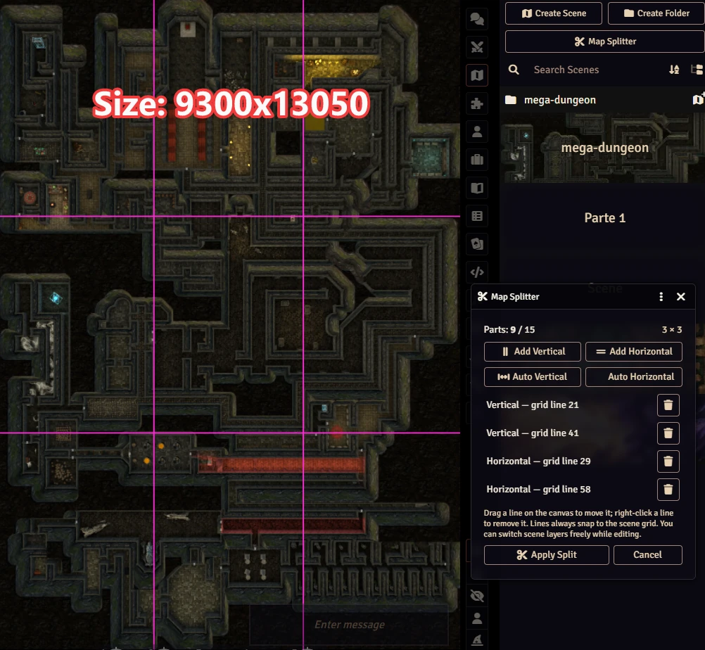
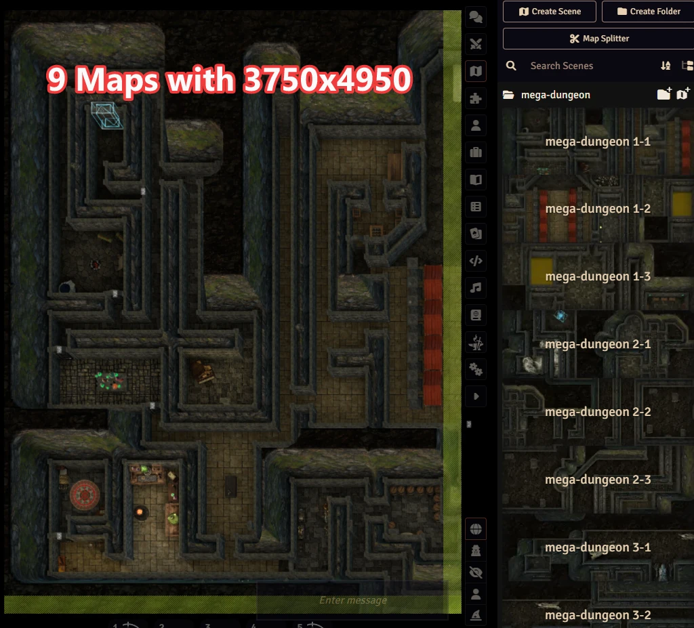
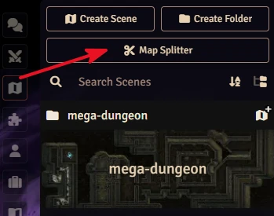

# 🗺️ Map Splitter

Slice huge maps into smaller, lighter scenes for Foundry VTT! 

**🌟 The most important feature:** Gigantic scenes eat player RAM and bandwidth — Map Splitter cuts them into smaller parts to improve performance, and **automatically creates teleport zones** so your players can seamlessly move between the adjacent maps!

### 📊 Performance Example

In the preview images below, you can see a massive performance gain:
- **Original Scene:** 9300x1350 resolution | 1632 Walls | 53 Lights | 12.9MB
- **Split Part:** 3750x4950 resolution | 315 Walls | 7 Lights | 116 Regions | 2.66MB





[](https://buymeacoffee.com/mestredigital) [](https://mestredigital.online/pages/projetos-en)

# 🛠️ How it Works

1. Open the scene you want to split and run `MapSplitter.Open();` (or simply use the button in the Scenes sidebar).

<p align="center"></p>

2. Add vertical and horizontal split lines from the floating menu. You can easily drag them around to choose the perfect cutting points. Right-click to remove a line.
3. Click **Apply Split**. The module will automatically slice the image, organize everything, and create the new lighter scenes for you. **Your original scene is never modified!**

## ✨ Features

- **Split up to 15 parts:** Easily cut your map into multiple pieces to guarantee smooth gameplay.
- **Smart Image Slicing:** The background image is sliced at high quality and saved as WebP format to save space.
- **Automatic Teleport Zones:** Adjacent scenes are linked with teleport regions! When a player walks to the edge of one map, they are smoothly teleported to the adjacent map. 
- **Seamless Transitions:** Players won't see an abrupt cut when moving between maps. The borders look natural!
- **Everything is Preserved:** Walls, doors, lights, sounds, and notes are automatically duplicated and adjusted for your new smaller scenes.
- **Easy Border Control:** You can easily add or remove border crossings with a simple click using the special Region Controls.
- **Organized Folders:** All new scenes are neatly placed into a specific Scene folder, keeping your world organized.

## 🚀 Usage

Open the map splitter tool from the Scenes directory sidebar button, or simply use this macro:

```js
MapSplitter.Open();
```

# 📦 Installation

Install via the Foundry VTT Module browser or use this manifest link:

```javascript
https://raw.githubusercontent.com/brunocalado/map-splitter/main/module.json
```

# ⚖️ Credits & License

* **Code License:** GNU GPLv3.

* **Demo:** The maps are from Dungeon Alchemist and are under their license: https://www.dungeonalchemist.com/terms-of-use
